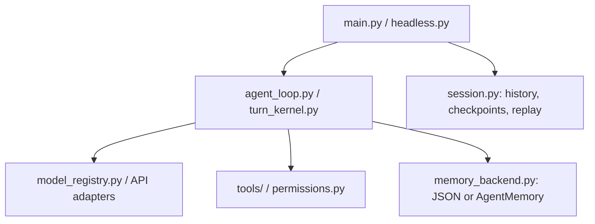

# Nanocode

A Python terminal coding agent with local tools, persistent memory, saved sessions, and checkpointed file recovery.

[中文说明](./README.zh-CN.md) · [GitHub](https://github.com/Zz9468/Nanocode) · [CI configuration](./.github/workflows/ci.yml)

Nanocode works in the directory where you start it. You can ask it to inspect a repository, edit files, run development commands, and explain the results. Tools and session storage run locally; model requests go to your configured API provider.

The active Python package is `nanocode`, the distribution is `nanocode-py`, and the package version is `0.1.0`. Python **3.11 or later** is required. MySQL, Node.js, and Docker are optional for the basic Python CLI.

## Implemented capabilities

| Capability | Implementation |
| --- | --- |
| Repository work | File listing, text search, reading, writing, exact edits, patches, Git operations, code navigation, and test execution. |
| Model connections | Anthropic, OpenAI, OpenRouter, and custom OpenAI-compatible endpoints, with configurable model fallbacks. |
| Sessions | Save, inspect, replay, and resume conversations for a workspace. Replay displays recorded events rather than executing them again. |
| Memory | JSON storage by default; an optional MySQL backend adds audited records, indexing jobs, embedding retrieval, and reranking. |
| File recovery | Checkpoints, rewind previews, and recovery of file changes recorded by supported editing tools. |
| Extensions and diagnostics | Local `SKILL.md` workflows, stdio MCP servers, instruction and hook inspection, configuration diagnostics, and readiness reports. |

## Quick start

### 1. Get the source

```bash
git clone https://github.com/Zz9468/Nanocode.git
cd Nanocode
```

### 2. Install in a virtual environment

Windows PowerShell:

```powershell
py -m venv .venv
.\.venv\Scripts\Activate.ps1
python -m pip install -e .
```

macOS / Linux:

```bash
python3 -m venv .venv
source .venv/bin/activate
python -m pip install -e .
```

If PowerShell blocks activation, use `.\.venv\Scripts\python.exe -m pip install -e .` and start the app with `.\.venv\Scripts\python.exe -m nanocode.main`.

### 3. Configure a model

Create `~/.nanocode/settings.json`. On Windows, this is `%USERPROFILE%\.nanocode\settings.json`.

Example using Qwen through an OpenAI-compatible endpoint:

```json
{
  "model": "qwen3.8-flash",
  "openaiBaseUrl": "https://dashscope.aliyuncs.com/compatible-mode/v1",
  "openaiApiKey": "YOUR_API_KEY"
}
```

Replace the key and choose a model available to your provider account. The CLI has no built-in default model; the example explicitly selects `qwen3.8-flash`.

### 4. Start in your workspace

```bash
nanocode --validate-config
nanocode-readiness --json
nanocode
```

In the interactive terminal, try:

```text
Read README.md, explain the repository structure, and identify the main entry points.
/tools
/memory
/session
```

`nanocode-py` is an alias for `nanocode`. Both can also be run as `python -m nanocode.main`. When required model or authentication settings are missing, the interactive CLI uses its built-in local fallback; that does not verify a live provider connection.

## Configuration

The main configuration is implemented in [nanocode/config.py](./nanocode/config.py). `~/.nanocode/settings.json` is merged with compatible `~/.claude/settings.json` settings. Nanocode settings take precedence over that compatibility file.

For model selection, `NANO_CODE_MODEL` overrides `settings.json`'s `model`, followed by `ANTHROPIC_MODEL`. Credential and endpoint precedence varies by channel. Prefer one configuration source per channel, and review the result with `nanocode --validate-config`.

| Connection | Configuration keys |
| --- | --- |
| Anthropic | `env.ANTHROPIC_API_KEY` or `env.ANTHROPIC_AUTH_TOKEN`; optional `env.ANTHROPIC_BASE_URL`. |
| OpenAI-compatible | `openaiApiKey` and `openaiBaseUrl`, or `env.OPENAI_API_KEY` and `env.OPENAI_BASE_URL`. |
| OpenRouter | Export `OPENROUTER_API_KEY`; optionally export `OPENROUTER_BASE_URL`. |
| Custom endpoint | `customApiKey` and `customBaseUrl`, or `CUSTOM_API_KEY` and `CUSTOM_API_BASE_URL`. |

The adapter is selected from the model name and configured channels. When changing providers, review both the model and credentials with `nanocode --validate-config`.

An environment-only setup is also supported. For example, in PowerShell:

```powershell
$env:NANO_CODE_MODEL = "qwen3.8-flash"
$env:OPENAI_BASE_URL = "https://dashscope.aliyuncs.com/compatible-mode/v1"
$env:OPENAI_API_KEY = "YOUR_API_KEY"
nanocode
```

The ordinary CLI **does not automatically load a project `.env` file**. Export variables in your shell or put them in `settings.json`. For the OpenAI-compatible example, values in the settings file's `env` object are preferred over matching shell variables. `.env.example` lists supported variables and provides a Docker Compose configuration example.

Additional settings include `fallbackModels`, provider-specific fallback lists, and `runtimeProfile` (`single` or `single-deep`). Configure fallback IDs that your endpoint actually offers. Local readiness checks inspect configuration; they do not prove that a key is valid, a model is available, or quota remains.

## Daily commands

| Command | Purpose |
| --- | --- |
| `/help`, `/tools` | List local commands and available agent tools. |
| `/model`, `/model <name>` | Inspect the model or persist a new model selection. |
| `/config`, `/readiness` | Inspect configuration and runtime readiness. |
| `/memory` | Inspect memory status. |
| `/session`, `/sessions` | Inspect the active session or list saved workspace sessions. |
| `/session-replay [session-id\|latest]` | Display the recorded conversation and runtime timeline. |
| `/checkpoints`, `/rewind-preview` | Inspect saved edit checkpoints and preview recovery. |
| `/rewind [latest\|steps\|checkpoint-id]` | Restore checkpointed file edits. |
| `/cost`, `/context`, `/tasks` | Inspect usage estimates, context state, and task state. |
| `/skills`, `/mcp`, `/instructions`, `/hooks` | Inspect the active integration and instruction surfaces. |
| `/exit` | Close the session. |

Session operations are also available outside the interactive UI:

```bash
nanocode --list-workspace-sessions
nanocode --inspect-session latest
nanocode --replay-session latest
nanocode --resume latest
nanocode --preview-rewind latest
```

Rewind restores recorded file content. It does not undo arbitrary shell commands, database changes, or other external side effects. Interactive permission decisions govern edits, commands, and access outside the workspace.

## Headless execution

```bash
nanocode-headless "Read README.md and summarize the project."
```

The prompt can also come from stdin. Headless execution uses the same model configuration and memory backend as the interactive CLI.

For an automation run that needs to modify files:

```bash
nanocode-headless --allow-edits "Update the docstring in nanocode/workspace.py."
```

`--allow-edits` also auto-approves requested commands and paths outside the workspace for that run. These approvals are session-scoped. Without it, operations requiring interactive approval may be denied.

Set `NANO_CODE_HEADLESS_MESSAGES_OUT` to a file path to export a trace of messages and tool results. Use `nanocode-headless --help` for the current argument list.

## Memory backends

### JSON: default setup

Without a backend override, [memory_backend.py](./nanocode/memory_backend.py) selects `json`. It requires no database or separate embedding service.

| Data | Location |
| --- | --- |
| Settings, permission decisions, prompt history | `~/.nanocode/` |
| Saved conversations and checkpoints | `~/.nanocode/sessions/` |
| User memory | `~/.nanocode/memory/` |
| Project memory | `<workspace>/.nanocode-memory/` |
| Local memory | `<workspace>/.nanocode-memory-local/` |

The current `.gitignore` excludes local memory directories and local credentials. Model configuration and memory backend configuration are separate.

### MySQL: optional memory service

[Package/AgentMemory](./Package/AgentMemory/) implements the MySQL service. Configure `Package/AgentMemory/Data/Local/runtime.env`, or point `NANOCODE_MEMORY_ENV` to another configuration file:

```dotenv
NANOCODE_MEMORY_BACKEND=mysql
NANOCODE_MYSQL_HOST=127.0.0.1
NANOCODE_MYSQL_PORT=3306
NANOCODE_MYSQL_DATABASE=nanocode_memory
NANOCODE_MYSQL_USER=YOUR_DATABASE_USER
NANOCODE_MYSQL_PASSWORD=YOUR_DATABASE_PASSWORD
```

The database must already exist; the account needs permission to create and update the memory tables. The connection uses TLS. The repository does not provision a MySQL server through Docker Compose.

Configure the model services separately for semantic indexing and memory processing:

| Variables | Role |
| --- | --- |
| `OMNIHELM_LLM_BASE_URL`, `OMNIHELM_LLM_API_KEY`, `OMNIHELM_LLM_MODEL` | Structured generation; the adapter appends `/chat/completions` to the base URL. |
| `OMNIHELM_EMBEDDING_BASE_URL`, `OMNIHELM_EMBEDDING_API_KEY`, `OMNIHELM_EMBEDDING_MODEL`, `OMNIHELM_EMBEDDING_DIMENSION` | Embedding requests; the adapter appends `/embeddings`. |
| `OMNIHELM_RERANK_BASE_URL`, `OMNIHELM_RERANK_API_KEY`, `OMNIHELM_RERANK_MODEL` | Reranking; supply the complete endpoint URL. |

Model service endpoints must use HTTPS. Defaults and other settings are defined in [Defaults.json](./Package/AgentMemory/Config/Defaults.json) and [Settings.py](./Package/AgentMemory/Src/Adapter/Out/Persistence/Settings.py). CLI provider keys are not automatically reused by this service. Selecting MySQL does not silently switch persistence to JSON when MySQL is unavailable.

Inspect a configured service with:

```bash
python -m nanocode.memory_admin status --workspace .
```

## Skills and MCP

Place local workflows at `.nanocode/skills/<name>/SKILL.md` or `~/.nanocode/skills/<name>/SKILL.md`. Compatible `.claude/skills/` directories are also discovered. Use `/skills` to inspect them.

Stdio MCP servers can be configured in `~/.nanocode/mcp.json` or the settings file's `mcpServers` object. Project `.mcp.json` loading requires explicit trust:

```bash
nanocode --trust-project-mcp
```

The equivalent environment switch is `NANO_CODE_TRUST_PROJECT_MCP=1`. External MCP servers may require their own runtimes, credentials, or packages.

## Docker

The [Dockerfile](./Dockerfile) packages the active Python code and defaults to displaying CLI help:

```bash
docker build -t nanocode-py .
docker run --rm nanocode-py --help
```

The `cli` and `headless` services in [docker-compose.yml](./docker-compose.yml) mount the workspace and persist user settings in the `nanocode-home` volume. For the existing Anthropic wiring, set `ANTHROPIC_API_KEY` and `ANTHROPIC_MODEL` in `.env`, then run:

```bash
docker compose run --rm --build cli --log-level WARNING
docker compose run --rm --build headless "Read README.md and summarize the project."
```

For other providers, pass their variables with `docker compose run -e ...` or configure the container's persisted settings. The host's `~/.nanocode/settings.json` is not automatically copied into the named volume. Compose also contains `gateway` and `cron` entries, but their referenced runtime modules are absent from the active Python package; those entries are not supported startup paths.

## Code map



| Path | Responsibility |
| --- | --- |
| `nanocode/` | Active runtime, CLI/TUI, model adapters, tools, memory bridge, and diagnostics. |
| `Main/NanocodeFrontline/` | Product contracts and entry/query surfaces with mirror tests. |
| `Package/AgentMemory/` | Memory use cases, MySQL persistence, model adapters, configuration, and mirror tests. |
| `Package/EngineeringStructure/` | Engineering structure projection and compliance surfaces with mirror tests. |
| `tests/` | Main Python regression suite. |
| `benchmarks/` | Evaluation and packaging/release verification runners. |
| `Package/EngineeringStructure/Config/` | Machine-readable material inventory and migration records. |
| `ts-src/` | TypeScript comparison and historical source material; not required by the Python quick start. |

The repository is in an ongoing structural migration. The active CLI still lives in `nanocode/`; module boundaries and migration evidence are tracked in the [material inventory](./Package/EngineeringStructure/Config/material-inventory.json). Only README documentation is published. Historical design documents and generated reports stay local; CI validates published code, configuration, and canonical test inputs.

## Development and verification

```bash
python -m pip install -e ".[dev]"
python -m pytest -q tests/test_packaging.py tests/test_engineering_inventory.py
python -m nanocode.memory_verify
```

`memory_verify` runs the main regression suite with an isolated home and temporary fixtures, then saves evidence under `Package/AgentMemory/Data/Test/`. It selects the real JSON backend for the ordinary regression run. Tests using real MySQL and Qwen run together with the memory mirror tests. They need a separate test database and model services configured in a local environment file:

```bash
python -m nanocode.memory_verify --mirrors --env-file /path/to/memory.env
```

The CI matrix is defined for Python 3.11/3.12 on Windows, macOS, and Linux. Consult the latest CI run for results; this README does not embed a fixed passing-test count.

Engineering structure and local readiness checks:

```bash
nanocode-structure-check --root . --hotspots 5 --max-dependency-upstream 4 --check-material-inventory --report Package/EngineeringStructure/Data/Test/structure-compliance.json
nanocode-readiness --json --fail-on blocked
```

<details>
<summary>Release artifact validation</summary>

The release runner produces reports at `benchmarks/release_readiness_results.json` and `benchmarks/release_readiness_results.md`. It includes a live provider smoke test, so successful live verification needs working credentials and may incur model usage. Validate existing reports with the gates recorded in the material inventory:

```bash
python -m nanocode.release_readiness --check-fallback-evidence benchmarks/release_readiness_results.json
python -m nanocode.release_readiness --check-release-report benchmarks/release_readiness_results.json
python -m nanocode.release_readiness --check-release-markdown benchmarks/release_readiness_results.md --release-json benchmarks/release_readiness_results.json
```

For local readiness artifacts, `nanocode-readiness --bundle-out <directory>` exports a bundle that can be checked with `python -m nanocode.release_readiness --check-readiness-bundle <directory>`. A readiness bundle is configuration evidence, not proof of a successful live API call.

</details>

