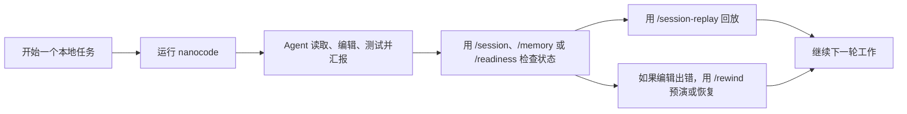
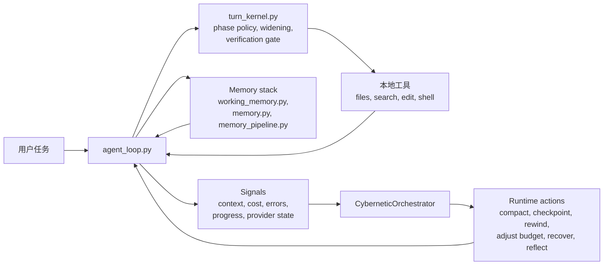

# Nanocode

<p align="center">
  <strong>一个面向本地开发的轻量级 coding agent：不只是聊天壳子，而是可恢复、可回放、可检查的终端工作流。</strong>
</p>

<p align="center">
  <a href="./README.md">English</a>
  |
  <a href="https://github.com/LiuMengxuan04/MiniCode">Nanocode 主仓库</a>
  |
  <a href="https://github.com/QUSETIONS/MiniCode-Python">Python 仓库</a>
</p>

<p align="center">
  
  
  
</p>

<p align="center">
  
</p>

<p align="center">
  <em>这不是示意图，而是真实的 Nanocode 前端 Demo：首页直接把 memory、session、rewind 和 readiness 作为一等产品能力展示出来。</em>
</p>

Nanocode 是使用 Python 实现的本地优先轻量级 Coding Agent。它面向真实的本地开发场景：agent 不只是能调模型和工具，还要能跨长会话保留状态、回看历史、撤销错误编辑，并把自己的运行状态说清楚。

如果把 Claude Code 看成成熟的终端 agent 产品体验，那么 Nanocode 更像它的轻量级、本地优先版本：更强调运行时透明性、可持续会话、记忆连续性、可回退编辑，以及可验证行为。

上面的截图来自真实的 Nanocode 前端 Demo。它想表达的是我们最看重的四件事：memory 让上下文不断线，session 可以 inspect 和 replay，rewind 让本地编辑更安全，readiness 能告诉你运行时是不是真的 ready。

## At a Glance

如果你想要的是下面这些体验，这个仓库就是给你的：

- 一个更像运行时而不是聊天窗口的终端 coding agent；
- 可 inspect、可 replay、可 resume、可总结的持久会话；
- 能保护工作上下文、并在需要时回注项目知识的记忆系统；
- 带 checkpoint、rewind preview 和恢复路径的安全本地编辑；
- 对 verification、widening、provider readiness 和失败原因都有显式信号。

如果只记住一句话，可以记这个：

> Nanocode 的核心目标是本地可信度：你应该能看清它做了什么、把改动撤回来，也能理解它为什么停在这里。

## Why This Repo Exists

很多 coding-agent README 会先讲模型接入和功能清单。Nanocode 想解决的是另一类问题：

> 运行时应该是可观察、可恢复、可测试的，而不只是“聪明”。

这会直接改变产品优先级：

| 优先级 | 在这个仓库里的含义 |
| --- | --- |
| Session-first | 会话可以 inspect、replay、resume 和 summary。 |
| Recovery-first | 文件编辑默认带 checkpoint、可 preview、可 rewind。 |
| Runtime-first | widening、verification、compaction 和 stop reason 都是显式的。 |
| Local-first | agent 围绕真实仓库、本地工具和终端工作流构建。 |

## Why Nanocode

| 维度 | Nanocode 的侧重点 |
| --- | --- |
| Durable sessions | 可以用本地命令 inspect、replay、resume 和 summary 当前或已保存会话。 |
| Memory as a first-class system | 保护活跃任务上下文、回注项目知识、在压缩时保持记忆感知、并持续沉淀有价值反思。 |
| Safe recovery | 自动 checkpoint、rewind preview、rewind safety group，以及 saved-session rewind。 |
| Runtime control | `single` / `single-deep` profile、phase-aware 执行、widening、verification gate 和结构化 stop reason。 |
| Observable behavior | runtime timeline、readiness report、provider 诊断、transcript summary 和 benchmark artifact。 |
| Local product surface | CLI/TUI 命令已经包括 `/session`、`/session-replay`、`/memory`、`/checkpoints`、`/rewind`、`/readiness`。 |
| Verifiable implementation | 根包由活跃测试套件兜底，不是“文档先行”的空壳。 |

## What You Can Do Today

以当前仓库状态，你已经可以：

- 用 `nanocode` 跑交互式终端 agent；
- 用 `nanocode-headless` 跑单次命令；
- 用 `nanocode-readiness` 跑 provider/runtime readiness 门禁；
- 用 `/session` 查看当前会话快照；
- 用 `/sessions` 浏览当前工作区历史会话；
- 用 `/session-replay` 回放会话；
- 用 `/memory` 查看记忆层状态；
- 用 `/checkpoints` 查看 checkpoint 历史；
- 用 `/rewind-preview` 和 `/rewind` 预演或执行回退；
- 用 `/readiness` 检查 provider 和 fallback 是否就绪。

Python 包名为 `nanocode`，发行包名为 `nanocode-py`，用户配置和会话位于 `~/.nanocode/`；`nanocode-py` 同时可作为交互命令的别名。

## 3-Minute Demo

### 0. 你需要什么

- Python 3.11+
- Windows、macOS 或 Linux 上的本地终端
- 如果要真实跑模型，需要可用的 provider/model 凭据

### 1. 安装并启动

```bash
git clone https://github.com/QUSETIONS/MiniCode-Python.git Nanocode-Python
cd Nanocode-Python
python -m pip install -e .[dev]
nanocode
```

### 2. 让它做一个真实仓库任务

```text
Explain this repository and tell me which commands matter most for day-to-day use.
```

这里你应该看到标准的 Nanocode 工作流：先读仓库、解释发现，再让你 inspect、replay 或继续会话。

### 3. 检查运行时在做什么

```text
/session
/memory
/readiness
```

### 4. 需要时回放或恢复

```text
/session-replay
/checkpoints
/rewind-preview
```

### 5. 跑一次 headless 单轮模式

```bash
nanocode-headless "Explain what this repo does."
```

### 6. 跑 readiness 门禁

```bash
nanocode-readiness --json --fail-on blocked
nanocode-readiness --examples-out .temp/readiness-fallback-examples.json --fail-on blocked
nanocode-readiness --doctor-out .temp/readiness-doctor.md --fail-on blocked
nanocode-readiness --repair-plan-out .temp/readiness-repair-plan.json --fail-on blocked
nanocode-readiness --patch-preview-out .temp/readiness-fallback-patch-preview.json --fail-on blocked
nanocode-readiness --bundle-out .temp/readiness-bundle --fail-on blocked
python -m nanocode.release_readiness --check-readiness-bundle .temp/readiness-bundle
python -m nanocode.release_readiness --write-artifact-manifest .temp/readiness-artifact-manifest.json --artifact fallback_examples_json=.temp/readiness-fallback-examples.json --artifact doctor_markdown=.temp/readiness-doctor.md --artifact repair_plan_json=.temp/readiness-repair-plan.json --artifact patch_preview_json=.temp/readiness-fallback-patch-preview.json
python -m nanocode.release_readiness --check-artifact-manifest .temp/readiness-artifact-manifest.json
python -m nanocode.release_readiness --check-fallback-patch-preview .temp/readiness-fallback-patch-preview.json
python -m nanocode.release_readiness --check-fallback-simulation .temp/readiness-bundle/readiness-fallback-simulations.json
python -m nanocode.release_readiness --check-fallback-switch-smoke
python benchmarks/release_readiness.py
python -m nanocode.release_readiness --check-fallback-evidence benchmarks/release_readiness_results.json
python -m nanocode.release_readiness --check-release-report benchmarks/release_readiness_results.json
python -m nanocode.release_readiness --check-release-markdown benchmarks/release_readiness_results.md --release-json benchmarks/release_readiness_results.json
```

CI 环境建议用 `--fail-on blocked`：provider warning 会被报告，但不会误伤本地产品门禁。发布候选如果要求 provider 和 fallback 都 ready，再用 `--fail-on warning`。`--examples-out` 只导出只读配置建议，不会写入凭据，也不会修改 Nanocode settings。`--doctor-out` 会额外导出一份给 CI 和 release bundle 使用的人工可读诊断报告，其中包含 primary provider、fallback coverage、configured/default fallback 和 live smoke 分离状态的 local preflight 清单。`--repair-plan-out` 会把同一修复路径导出为已脱敏 JSON，让 CI 可以审计下一步动作但不写入凭据。`--patch-preview-out` 会导出已脱敏的 settings merge patch 预览，方便先审查选定 fallback provider，再由人工合并到本地 settings。artifact manifest 命令会记录 readiness artifacts 的存在性、大小和 SHA-256，用于发现证据缺失或漂移。`--bundle-out` 会一次性写出 examples、doctor、repair plan、patch preview、离线 fallback simulations 和 manifest，是本地最低操作成本的检查入口。`--check-fallback-patch-preview` 会校验 patch preview 的 safety 字段、apply notes、merge patch 形态和脱敏状态。`--check-fallback-simulation` 会逐项校验离线模拟并拒绝任何 live provider 声明，不会调用 provider。`--check-readiness-bundle` 会把 bundle 作为一个整体校验 schema、manifest 和脱敏状态。`benchmarks/release_readiness.py` 默认只刷新报告；如果发布候选必须在 live-provider 风险上失败，使用 `python benchmarks/release_readiness.py --fail-on at-risk`。它也会校验 headless provider trace，确保 live-smoke 失败仍保留机器可读的 readiness 快照和 repair plan。`--check-fallback-evidence` 会校验 provider 风险是否配有 fallback 覆盖或可审计的 fallback 修复路径。`--check-release-report` 会校验完整 release JSON 的 schema 和证据链接；只要诊断证据完整，provider `at-risk` 不会被误判为本地门禁失败。`--check-release-markdown` 会校验人工可读 Markdown 报告是否覆盖 JSON 中的状态、smoke、provider、fallback 和 artifact 证据。

## Typical Workflow



核心点很简单：Nanocode 不想把运行时藏起来。它让你看见工作过程、检查状态，并在出错时直接恢复，而不是自己手工善后。

这套思路同样适用于 memory：活跃任务上下文会被保护，耐久项目知识会在需要时回注，compaction 也可以利用记忆而不是盲目丢上下文。

## Everyday Commands

如果一开始只记六个命令，先记这几个：`/session`、`/sessions`、`/session-replay`、`/memory`、`/rewind-preview`、`/readiness`。

| 命令 | 作用 |
| --- | --- |
| `/session` | 查看当前 live session 快照。 |
| `/sessions` | 列出当前 workspace 的已保存会话。 |
| `/session-replay` | 回放当前或已保存会话，包括 transcript 和 runtime 上下文。 |
| `/memory` | 查看当前 workspace 的记忆系统状态。 |
| `/checkpoints` | 查看当前或已保存会话的 checkpoint 历史。 |
| `/rewind-preview` | 在真正改文件前，先看 rewind 会恢复什么。 |
| `/rewind` | 按最新 edit group、步数或 checkpoint id 执行回退。 |
| `/readiness` | 检查 runtime/provider readiness、fallback coverage 和产品面状态。 |

## Current Status

这个仓库已经过了纯 prototype 阶段。它现在更像一个可用的本地产品，但仍在继续朝“更成熟的轻量级 Claude Code 体验”收紧。

当前生效的主包是根目录 `nanocode/`；`pyproject.toml` 提供 `nanocode` 主命令及 `nanocode-py` 别名。

最近一次跨平台 CI 验证结果：

```text
1311 passed, 2 skipped
```

验证命令：

```bash
python -m compileall -q nanocode tests benchmarks Main Package
python -m nanocode.structure_check --root . --hotspots 5 --max-dependency-upstream 4 --check-material-inventory --report .temp/structure-compliance.json
python -m nanocode.release_readiness --check-structure-compliance-artifact .temp/structure-compliance.json
python -m nanocode.readiness --json --fail-on blocked
python -m nanocode.readiness --examples-out .temp/readiness-fallback-examples.json --fail-on blocked
python -m nanocode.readiness --doctor-out .temp/readiness-doctor.md --fail-on blocked
python -m nanocode.readiness --repair-plan-out .temp/readiness-repair-plan.json --fail-on blocked
python -m nanocode.readiness --patch-preview-out .temp/readiness-fallback-patch-preview.json --fail-on blocked
python -m nanocode.readiness --bundle-out .temp/readiness-bundle --fail-on blocked
python -m nanocode.release_readiness --check-readiness-bundle .temp/readiness-bundle
python -m nanocode.release_readiness --write-artifact-manifest .temp/readiness-artifact-manifest.json --artifact fallback_examples_json=.temp/readiness-fallback-examples.json --artifact doctor_markdown=.temp/readiness-doctor.md --artifact repair_plan_json=.temp/readiness-repair-plan.json --artifact patch_preview_json=.temp/readiness-fallback-patch-preview.json
python -m nanocode.release_readiness --check-artifact-manifest .temp/readiness-artifact-manifest.json
python -m nanocode.release_readiness --check-fallback-patch-preview .temp/readiness-fallback-patch-preview.json
python -m nanocode.release_readiness --check-fallback-simulation .temp/readiness-bundle/readiness-fallback-simulations.json
python -m nanocode.release_readiness --check-fallback-switch-smoke
python benchmarks/release_readiness.py
python -m nanocode.release_readiness --check-fallback-evidence benchmarks/release_readiness_results.json
python -m nanocode.release_readiness --check-release-report benchmarks/release_readiness_results.json
python -m nanocode.release_readiness --check-release-markdown benchmarks/release_readiness_results.md --release-json benchmarks/release_readiness_results.json
python -m pytest -q --import-mode=importlib
```

实话实说，当前状态是：

- runtime、session、replay、checkpoint、rewind、readiness 和结构合规门禁这些产品面已经比较稳；
- memory 不是外挂：working memory、project memory、memory injection 和 memory-aware compaction 已经进了主运行路径；
- provider 和 fallback 诊断已经包含 local preflight 清单、结构化 live-smoke 失败上下文和已校验的 headless trace artifact；
- 真实 provider 是否可用，仍然取决于你本地的凭据和通道配置；
- 这个项目今天已经能用，但还在继续往更完整的轻量级 Claude Code 体验走。

真实 provider readiness 仍然取决于本地凭据和通道可用性，所以默认 CI readiness 门禁只在 runtime blocked 时失败。

## Architecture



重点不是这张图本身，而是运行时状态在这里是显式对象：

- loop 可以 widen，而不是静默卡死；
- verification 可以拦住过早的 “done”；
- memory 可以保护任务关键上下文，并在需要时回注项目知识，而不是只依赖当前 chat window；
- session 状态可以跨进程存在；
- rewind 可以撤销本地编辑，而不是让你手工收拾残局；
- readiness 可以告诉你失败到底是本地逻辑还是 provider availability。

## Repository Guide

| 路径 | 作用 |
| --- | --- |
| `nanocode/` | 安装和测试使用的规范 Python 包。 |
| `tests/` | 活跃测试套件。 |
| `benchmarks/` | runtime profile、release readiness runner 和生成报告。 |
| `Docs/Documentation/` | 架构说明、优化记录和产品化报告。 |
| `openspec/` | spec、归档变更记录，以及 build/verify 规划产物。 |
| `.nanocode-memory/` | runtime 创建的 workspace 级持久记忆状态。 |

## Core Modules

记忆的新实现位于 `Package/AgentMemory/`。启用 `mysql` 后，真实轮次证据进入持久任务队列，Qwen 按严格 JSON Schema 提取候选，并检查事件 ID、原文引用和作用域；MySQL 事务统一保存正文、版本审计及向量任务。检索对同一作用域语料执行中文 BM25 与向量余弦召回，经 RRF 合并及 DashScope 精排后注入最多 5 条、1000 token 的参考记忆。删除、归档、内容版本不匹配和来源失效的条目不进入提示。

本地配置位于 Git 忽略的 `Package/AgentMemory/Data/Local/runtime.env`，支持已有的 `OMNIHELM_LLM_*`、`OMNIHELM_EMBEDDING_*`、`OMNIHELM_RERANK_*`，以及 `NANOCODE_MYSQL_HOST/PORT/USER/PASSWORD/DATABASE`。使用 `NANOCODE_MEMORY_BACKEND=mysql` 启用；环境变量设为 `json` 可切回保留的旧文件后端。CLI、headless 和 `/memory` 使用同一配置。原始 JSON 迁移只读且可重复执行，导出中的三个作用域子目录兼容旧 JSON 格式。

模型调用费用账本保存在 `Data/Local/model_costs.json`：请求发送前按输入字节上界和最大输出预留费用，跨线程和进程加锁，预算最多人民币 25 元；超时或无法确认用量的请求保留预留额度。估算使用已核验的官方单价，不代表账户实际账单。不要删除账本后继续同一次验收。

```powershell
.venv/python.exe -m nanocode.memory_admin status
.venv/python.exe -m nanocode.memory_admin jobs
.venv/python.exe -m nanocode.memory_admin search --query "项目记忆如何保存"
.venv/python.exe -m nanocode.memory_admin migrate
.venv/python.exe -m nanocode.memory_admin export
.venv/python.exe -m nanocode.memory_admin reindex
.venv/python.exe -m nanocode.memory_verify --mirrors
.venv/python.exe -m nanocode.memory_verify
.venv/python.exe -m nanocode.memory_acceptance
```

验收使用独立的 `nanocode_memory_test` 数据库。固定的 50 条标注查询和验收报告保存在 `Package/AgentMemory/Data/Test/`。验证器在仓库既定的 `.temp` 过程载体运行 pytest，将完整测试证据归档至模块 `Data/Test`。当前 MySQL 8.4 保存向量，应用执行余弦检索，适合个人代理的记忆规模；大规模 ANN 服务可继续通过出站端口扩展。后台整理基于真实完成轮次数触发，归纳结果保留来源及版本，源记忆继续保存。

后台任务按当前用户、项目和机器作用域领取，失败后自动重试，CLI 和 headless 退出时限时等待任务完成；超时任务保留在持久队列。MySQL 不可用且启用 fail-open 时，查询返回空上下文，轮次证据写入本地 Outbox，连接恢复后补交。上下文压缩同时保留当前会话摘要和按最新问题检索的记忆，整理产生的空结果也会保存检查点。可用 `NANOCODE_MEMORY_ENV` 指定配置文件、`NANOCODE_MEMORY_DATA_DIR` 指定过程数据目录、`NANOCODE_MEMORY_CURATOR_INTERVAL` 设置整理间隔；隔离数据目录时仍默认共用原费用账本。

| 模块 | 作用 |
| --- | --- |
| `nanocode/agent_loop.py` | 主 model/tool loop、runtime event flow 和产品集成。 |
| `nanocode/turn_kernel.py` | step policy、phase transition、widening 和 verification gate。 |
| `nanocode/session.py` | durable session、inspect/replay 视图、checkpoint 和 rewind helper。 |
| `nanocode/cli_commands.py` | `/session`、`/replay`、`/rewind`、`/readiness` 这类本地产品命令。 |
| `nanocode/memory.py` | 长期项目记忆管理和检索入口。 |
| `nanocode/working_memory.py` | 在 compaction 压力下仍会保留的 working memory 条目。 |
| `nanocode/memory_pipeline.py` | memory retrieval、injection、reflection writeback 和优化闭环。 |
| `nanocode/product_surfaces.py` | readiness、hooks、instructions、delegation、extensions 等用户可见摘要。 |
| `nanocode/readiness.py` | 独立 readiness CLI，用于本地检查和 CI 门禁。 |
| `nanocode/release_readiness.py` | 面向 release 的 runtime smoke 与 provider readiness 检查。 |
| `nanocode/model_switcher.py` | 有界 fallback 和 failover 选择逻辑。 |
| `nanocode/runtime_profiles.py` | `single`、`single-deep` 等 runtime profile。 |
| `nanocode/cybernetic_orchestrator.py` | runtime control 生命周期总控。 |

## 项目来源与兼容性

| 版本 | 仓库 | 侧重点 |
| --- | --- | --- |
| TypeScript | [LiuMengxuan04/Nanocode](https://github.com/LiuMengxuan04/MiniCode) | 主线终端 agent、TUI、MCP、skills、session 和 context control。 |
| Python / Nanocode | [Python 仓库](https://github.com/QUSETIONS/MiniCode-Python) | `nanocode` 包和命令使用 `~/.nanocode/` 保存配置与会话。 |
| Rust | [harkerhand/Nanocode-rs](https://github.com/harkerhand/MiniCode-rs/tree/master) | 偏系统侧实现与实验。 |
| Java | [hobbescalvin414-tech/nanocode4j](https://github.com/hobbescalvin414-tech/minicode4j/tree/feat/default-ts-ui) | Java 实现，沿着 TypeScript 风格 UI 方向演进。 |

## Documentation

如果你想继续看更深的实现与产品化记录，可以从这里开始：

- [English README](./README.md)
- [Optimization Summary](./Docs/Documentation/OPTIMIZATION_SUMMARY.md)
- [Memory Theory](./Docs/Documentation/memory_theory.md)
- [Nanocode-lite Productization Design](./Docs/Documentation/superpowers/specs/2026-06-05-nanocode-lite-productization-design.md)
- [Nanocode-lite Build Plan](./Docs/Documentation/superpowers/plans/2026-06-05-nanocode-lite-productization-build.md)
- [Nanocode-lite Verify Report](./Docs/Documentation/superpowers/reports/2026-06-05-nanocode-lite-productization-verify.md)
- [Main Nanocode Repository](https://github.com/LiuMengxuan04/MiniCode)

## Design Principles

- 让运行时保持可检查。
- 把 memory 当成可控的 runtime 子系统，而不是事后补丁。
- 用可测量信号替代“prompt 玄学”。
- 把恢复能力做成产品特性，而不是手工清理步骤。
- 把 verification 视为执行路径的一部分，而不只是汇报。
- 让文档描述已实现行为，而不是未来愿景。
