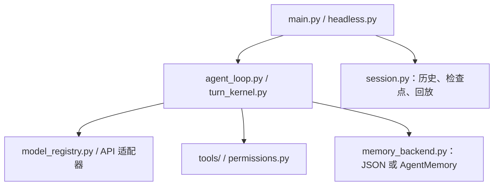

# Nanocode

基于 Python 的终端编码助手，支持本地工具、持久记忆、会话保存和文件编辑回退。

[English](./README.md) · [GitHub 仓库](https://github.com/Zz9468/Nanocode) · [CI 配置](./.github/workflows/ci.yml)

Nanocode 在启动时所在的目录工作。你可以让它阅读仓库、修改文件、执行开发命令并解释结果。工具执行和会话存储发生在本地，模型请求发送到你配置的 API 服务。

当前运行包为 `nanocode`，发行包为 `nanocode-py`，包版本为 `0.1.0`。需要 **Python 3.11 或更高版本**。基础 Python CLI 无需安装 MySQL、Node.js 或 Docker。

## 已实现的功能

| 功能 | 当前实现 |
| --- | --- |
| 仓库操作 | 文件列表、文本搜索、读取、写入、精确编辑、补丁、Git 操作、代码导航和测试执行。 |
| 模型接入 | Anthropic、OpenAI、OpenRouter，以及自定义 OpenAI 兼容端点；支持配置候选回退模型。 |
| 会话管理 | 按工作区保存、查看、回放和恢复会话。回放展示已有记录，不会重新执行其中的操作。 |
| 记忆系统 | 默认使用 JSON；可选 MySQL 后端提供审计记录、索引任务、向量检索和重排。 |
| 文件恢复 | 对支持的编辑工具记录检查点，提供回退预览和文件内容恢复。 |
| 扩展与诊断 | 本地 `SKILL.md` 工作流、stdio MCP 服务、指令与钩子检查、配置诊断和就绪报告。 |

## 快速开始

### 1. 获取代码

```bash
git clone https://github.com/Zz9468/Nanocode.git
cd Nanocode
```

### 2. 创建虚拟环境并安装

Windows PowerShell：

```powershell
py -m venv .venv
.\.venv\Scripts\Activate.ps1
python -m pip install -e .
```

macOS / Linux：

```bash
python3 -m venv .venv
source .venv/bin/activate
python -m pip install -e .
```

如果 PowerShell 阻止激活脚本，可直接执行 `.\.venv\Scripts\python.exe -m pip install -e .`，并用 `.\.venv\Scripts\python.exe -m nanocode.main` 启动。

### 3. 配置模型

创建 `~/.nanocode/settings.json`。Windows 对应路径是 `%USERPROFILE%\.nanocode\settings.json`。

以下示例通过 OpenAI 兼容端点接入 Qwen：

```json
{
  "model": "qwen3.8-flash",
  "openaiBaseUrl": "https://dashscope.aliyuncs.com/compatible-mode/v1",
  "openaiApiKey": "YOUR_API_KEY"
}
```

替换 API Key，并使用你的服务商账号实际可用的模型。CLI 没有写死默认模型；上面的示例显式选择了 `qwen3.8-flash`。

### 4. 在目标工作区启动

```bash
nanocode --validate-config
nanocode-readiness --json
nanocode
```

进入终端后可以尝试：

```text
阅读 README.md，解释项目结构并找出主要入口。
/tools
/memory
/session
```

`nanocode-py` 是 `nanocode` 的别名，也可以通过 `python -m nanocode.main` 启动。缺少模型或鉴权配置时，交互 CLI 会使用内置的本地回退模式；进入该模式不代表真实模型服务已接通。

## 配置方式

配置加载逻辑位于 [nanocode/config.py](./nanocode/config.py)。主配置 `~/.nanocode/settings.json` 会与兼容配置 `~/.claude/settings.json` 合并，Nanocode 配置优先于该兼容文件。

模型选择的优先级依次是 `NANO_CODE_MODEL`、`settings.json` 的 `model`、`ANTHROPIC_MODEL`。不同通道的密钥和端点读取顺序存在差异，建议每个通道选用一种配置方式，再通过 `nanocode --validate-config` 核对结果。

| 接入方式 | 配置字段 |
| --- | --- |
| Anthropic | `env.ANTHROPIC_API_KEY` 或 `env.ANTHROPIC_AUTH_TOKEN`；可选 `env.ANTHROPIC_BASE_URL`。 |
| OpenAI 兼容接口 | `openaiApiKey`、`openaiBaseUrl`，或 `env.OPENAI_API_KEY`、`env.OPENAI_BASE_URL`。 |
| OpenRouter | 在进程环境中设置 `OPENROUTER_API_KEY`；可选 `OPENROUTER_BASE_URL`。 |
| 自定义端点 | `customApiKey`、`customBaseUrl`，或 `CUSTOM_API_KEY`、`CUSTOM_API_BASE_URL`。 |

适配器根据模型名称和已配置的通道选择。切换服务商时，需要同时核对模型和密钥，可通过 `nanocode --validate-config` 查看诊断。

也可以使用环境变量，例如 PowerShell：

```powershell
$env:NANO_CODE_MODEL = "qwen3.8-flash"
$env:OPENAI_BASE_URL = "https://dashscope.aliyuncs.com/compatible-mode/v1"
$env:OPENAI_API_KEY = "YOUR_API_KEY"
nanocode
```

普通 CLI **不会自动读取项目 `.env` 文件**。请在终端中设置变量，或写入 `settings.json`。对于上面的 OpenAI 兼容示例，配置文件 `env` 对象中的值优先于同名终端变量。`.env.example` 用于查看支持的变量，也可作为 Docker Compose 配置的参考。

其他配置包括 `fallbackModels`、各服务商的候选回退模型列表，以及 `runtimeProfile`（`single` 或 `single-deep`）。候选模型必须是当前端点实际提供的模型。就绪检查核对本地配置，不能证明密钥有效、模型可用或账号额度充足。

## 常用命令

| 命令 | 作用 |
| --- | --- |
| `/help`、`/tools` | 查看本地命令和可用工具。 |
| `/model`、`/model <name>` | 查看模型，或保存新的模型选择。 |
| `/config`、`/readiness` | 查看配置诊断和运行时就绪状态。 |
| `/memory` | 查看记忆状态。 |
| `/session`、`/sessions` | 查看当前会话，或列出工作区保存的会话。 |
| `/session-replay [session-id\|latest]` | 展示记录的对话和运行时间线。 |
| `/checkpoints`、`/rewind-preview` | 查看编辑检查点和回退预览。 |
| `/rewind [latest\|steps\|checkpoint-id]` | 恢复检查点记录的文件编辑。 |
| `/cost`、`/context`、`/tasks` | 查看用量估计、上下文状态和任务状态。 |
| `/skills`、`/mcp`、`/instructions`、`/hooks` | 查看集成、指令和钩子状态。 |
| `/exit` | 退出会话。 |

部分会话操作也可以直接从命令行执行：

```bash
nanocode --list-workspace-sessions
nanocode --inspect-session latest
nanocode --replay-session latest
nanocode --resume latest
nanocode --preview-rewind latest
```

回退只恢复被记录的文件内容，不会撤销任意 shell 命令、数据库修改或其他外部副作用。交互模式通过权限决策控制文件编辑、命令执行和工作区外的路径访问。

## 无交互执行

```bash
nanocode-headless "阅读 README.md，概括这个项目。"
```

也可以通过标准输入提供提示词。无交互模式使用与交互 CLI 相同的模型配置和记忆后端。

需要修改文件的自动化任务可以显式启用：

```bash
nanocode-headless --allow-edits "更新 nanocode/workspace.py 中的文档字符串。"
```

`--allow-edits` 同时会自动批准本次运行请求的命令执行和工作区外路径访问。授权仅在该会话内有效。不启用时，需要交互授权的操作可能被拒绝。

将 `NANO_CODE_HEADLESS_MESSAGES_OUT` 设置为文件路径，可导出消息和工具结果记录。当前参数以 `nanocode-headless --help` 为准。

## 记忆后端

### JSON：默认方式

没有覆盖后端设置时，[memory_backend.py](./nanocode/memory_backend.py) 选择 `json`，无需数据库或额外的向量服务。

| 数据 | 位置 |
| --- | --- |
| 配置、权限决策、提示词历史 | `~/.nanocode/` |
| 保存的对话和检查点 | `~/.nanocode/sessions/` |
| 用户记忆 | `~/.nanocode/memory/` |
| 项目记忆 | `<workspace>/.nanocode-memory/` |
| 本地记忆 | `<workspace>/.nanocode-memory-local/` |

当前 `.gitignore` 已排除本地记忆目录和本地密钥文件。模型接入配置与记忆后端配置相互独立。

### MySQL：可选记忆服务

[Package/AgentMemory](./Package/AgentMemory/) 实现了 MySQL 记忆服务。在 `Package/AgentMemory/Data/Local/runtime.env` 中配置，或通过 `NANOCODE_MEMORY_ENV` 指向另一个配置文件：

```dotenv
NANOCODE_MEMORY_BACKEND=mysql
NANOCODE_MYSQL_HOST=127.0.0.1
NANOCODE_MYSQL_PORT=3306
NANOCODE_MYSQL_DATABASE=nanocode_memory
NANOCODE_MYSQL_USER=YOUR_DATABASE_USER
NANOCODE_MYSQL_PASSWORD=YOUR_DATABASE_PASSWORD
```

数据库需要提前创建，账号需要具备创建和更新记忆表的权限，连接使用 TLS。仓库的 Docker Compose 配置不负责启动 MySQL 服务。

语义索引和记忆处理还需要单独配置模型服务：

| 变量 | 作用 |
| --- | --- |
| `OMNIHELM_LLM_BASE_URL`、`OMNIHELM_LLM_API_KEY`、`OMNIHELM_LLM_MODEL` | 结构化生成；适配器在基础地址后添加 `/chat/completions`。 |
| `OMNIHELM_EMBEDDING_BASE_URL`、`OMNIHELM_EMBEDDING_API_KEY`、`OMNIHELM_EMBEDDING_MODEL`、`OMNIHELM_EMBEDDING_DIMENSION` | 向量请求；适配器添加 `/embeddings`。 |
| `OMNIHELM_RERANK_BASE_URL`、`OMNIHELM_RERANK_API_KEY`、`OMNIHELM_RERANK_MODEL` | 重排；需要填写完整端点地址。 |

模型服务端点要求 HTTPS。默认值和其他设置见 [Defaults.json](./Package/AgentMemory/Config/Defaults.json) 与 [Settings.py](./Package/AgentMemory/Src/Adapter/Out/Persistence/Settings.py)。该服务不会自动复用 CLI 的模型密钥；选择 MySQL 后，数据库不可用时也不会悄悄改用 JSON 存储。

查看已配置服务的状态：

```bash
python -m nanocode.memory_admin status --workspace .
```

## Skills 与 MCP

本地工作流放在 `.nanocode/skills/<name>/SKILL.md` 或 `~/.nanocode/skills/<name>/SKILL.md`。兼容的 `.claude/skills/` 目录也会被发现，可通过 `/skills` 查看。

stdio MCP 服务可配置在 `~/.nanocode/mcp.json` 或设置文件的 `mcpServers` 对象中。项目 `.mcp.json` 需要显式信任才会加载：

```bash
nanocode --trust-project-mcp
```

等效环境变量是 `NANO_CODE_TRUST_PROJECT_MCP=1`。外部 MCP 服务可能需要自己的运行时、密钥或依赖包。

## Docker

[Dockerfile](./Dockerfile) 打包当前 Python 代码，镜像默认显示 CLI 帮助：

```bash
docker build -t nanocode-py .
docker run --rm nanocode-py --help
```

[docker-compose.yml](./docker-compose.yml) 的 `cli` 和 `headless` 服务挂载工作区，并通过 `nanocode-home` 卷保存用户配置。使用现有的 Anthropic 环境变量配置时，在 `.env` 中填写 `ANTHROPIC_API_KEY`、`ANTHROPIC_MODEL`，然后执行：

```bash
docker compose run --rm --build cli --log-level WARNING
docker compose run --rm --build headless "阅读 README.md，概括这个项目。"
```

其他服务商可通过 `docker compose run -e ...` 传入变量，或配置容器内持久保存的设置。宿主机的 `~/.nanocode/settings.json` 不会自动复制进数据卷。Compose 中还保留了 `gateway` 和 `cron` 条目，但它们引用的运行模块不在当前 Python 包中，不能作为已支持的启动方式。

## 代码结构



| 路径 | 职责 |
| --- | --- |
| `nanocode/` | 当前运行时、CLI/TUI、模型适配器、工具、记忆桥接和诊断。 |
| `Main/NanocodeFrontline/` | 产品契约、入口与查询表面，以及镜像测试。 |
| `Package/AgentMemory/` | 记忆用例、MySQL 存储、模型适配器、配置和镜像测试。 |
| `Package/EngineeringStructure/` | 工程结构投影与合规检查表面，以及镜像测试。 |
| `tests/` | 主要 Python 回归测试。 |
| `benchmarks/` | 评估、打包和发布验证脚本。 |
| `Package/EngineeringStructure/Config/` | 机器可读的材料清单、迁移记录与对齐来源。 |
| `ts-src/` | TypeScript 对照与历史源码材料，Python 快速开始不依赖它。 |

仓库仍在进行结构迁移，当前 CLI 实现在 `nanocode/`。模块边界与迁移证据见[材料清单](./Package/EngineeringStructure/Config/material-inventory.json)。公开仓库只保留 README 类文档；历史设计文档和生成报告留在本地，CI 检查已提交的代码、配置与真实测试输入。

## 开发与验证

```bash
python -m pip install -e ".[dev]"
python -m pytest -q tests/test_packaging.py tests/test_engineering_inventory.py
python -m nanocode.memory_verify
```

`memory_verify` 使用隔离的用户目录和临时测试数据运行主回归测试，并将证据保存到 `Package/AgentMemory/Data/Test/`。普通回归使用真实 JSON 后端；使用真实 MySQL 和 Qwen 的测试与记忆镜像测试一同执行，需要在本地环境文件中配置独立测试数据库和模型服务：

```bash
python -m nanocode.memory_verify --mirrors --env-file /path/to/memory.env
```

CI 配置了 Windows、macOS、Linux 上的 Python 3.11/3.12 测试矩阵。结果以最新 CI 运行为准，README 不写死通过数量。

工程结构与本地就绪检查：

```bash
nanocode-structure-check --root . --hotspots 5 --max-dependency-upstream 4 --check-material-inventory --report Package/EngineeringStructure/Data/Test/structure-compliance.json
nanocode-readiness --json --fail-on blocked
```

<details>
<summary>发布产物验证</summary>

发布脚本生成 `benchmarks/release_readiness_results.json` 和 `benchmarks/release_readiness_results.md`。其中包含真实模型服务的冒烟检查，成功的服务验证需要有效密钥并可能产生模型用量。可通过材料清单记录的检查命令验证已有报告：

```bash
python -m nanocode.release_readiness --check-fallback-evidence benchmarks/release_readiness_results.json
python -m nanocode.release_readiness --check-release-report benchmarks/release_readiness_results.json
python -m nanocode.release_readiness --check-release-markdown benchmarks/release_readiness_results.md --release-json benchmarks/release_readiness_results.json
```

`nanocode-readiness --bundle-out <directory>` 可以导出本地就绪产物包，再用 `python -m nanocode.release_readiness --check-readiness-bundle <directory>` 检查。就绪产物包提供配置证据，不代表真实 API 调用已经成功。

</details>

## 延伸阅读

- [英文 README](./README.md)
- [产品架构投影](./Main/NanocodeFrontline/Src/Application/Query/CurrentRuntimeProjection.py)
- [记忆模块](./Package/AgentMemory/Src/Boot/App.py)
- [工程结构检查器](./Package/EngineeringStructure/Src/Application/Query/StructureCompliance.py)
- [TypeScript 对齐来源](./Package/EngineeringStructure/Config/ts-parity-provenance.json)

历史源码参考：[上游终端项目](https://github.com/LiuMengxuan04/MiniCode)与[上游 Python 项目](https://github.com/QUSETIONS/MiniCode-Python)。
